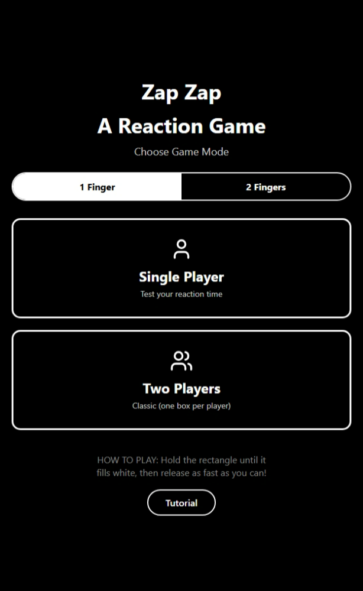
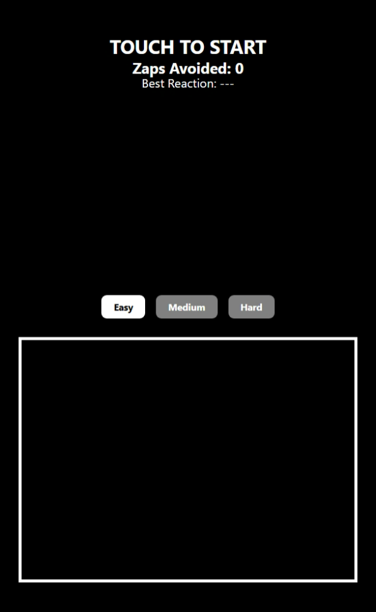
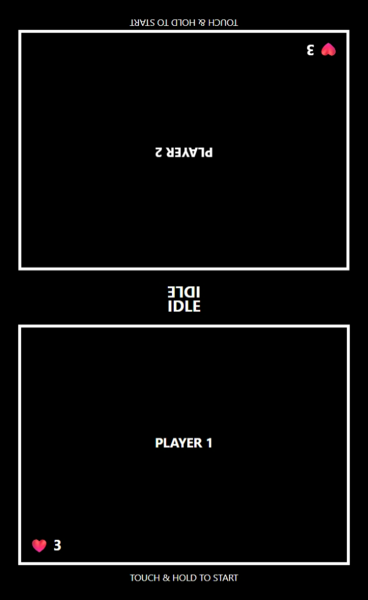
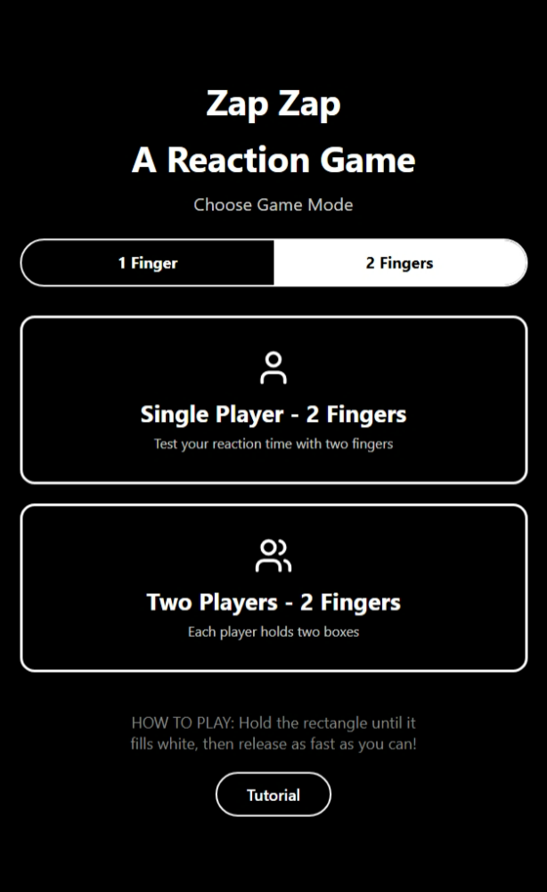
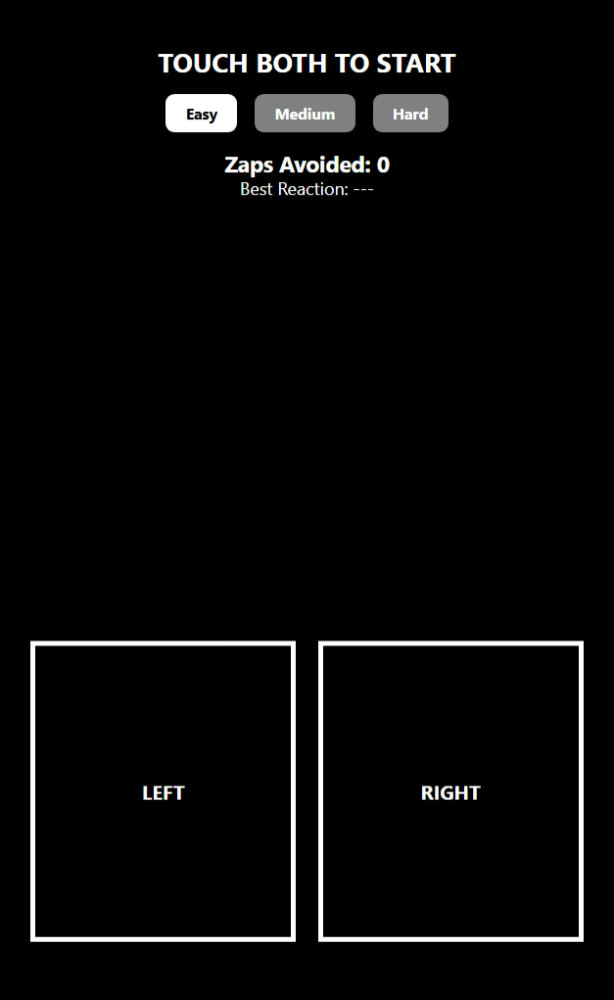
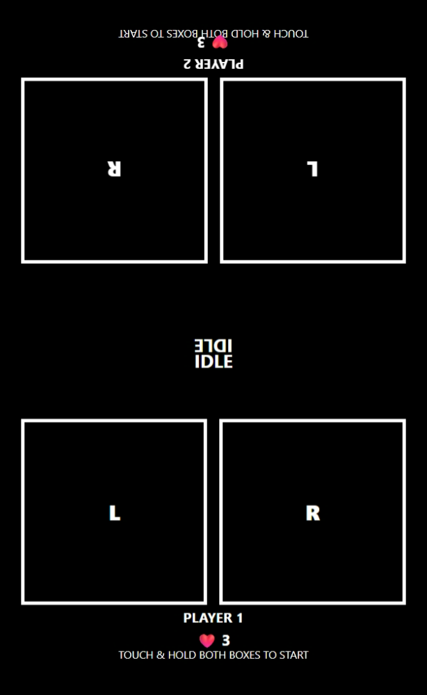

# ZAPZAP Reaction Mobile Game
A small open-source mobile reaction game focused on timing and reflexes.
Players hold their finger on the screen and must release it as soon as a zap appears.
Supports both single-player and two-player modes on the same device.


## Expo app 👋

This is an [Expo](https://expo.dev) project created with [`create-expo-app`](https://www.npmjs.com/package/create-expo-app).

## Get started

To start the app, in your terminal run:

```bash
npm run start
```

In the output, you'll find options to open the app in:

- [a development build](https://docs.expo.dev/develop/development-builds/introduction/)
- [an Android emulator](https://docs.expo.dev/workflow/android-studio-emulator/)
- [an iOS simulator](https://docs.expo.dev/workflow/ios-simulator/)
- [Expo Go](https://expo.dev/go), a limited sandbox for trying out app development with Expo

You can start developing by editing the files inside the **app** directory. This project uses [file-based routing](https://docs.expo.dev/router/introduction).

## App Screenshots

### One Finger 
| Main Menu | Single Player | Two Players |
| --- | --- | --- |
|  |  |  |

### Two fingers
| Main Menu | Single Player | Two Players |
| --- | --- | --- |
|  |  |  |
